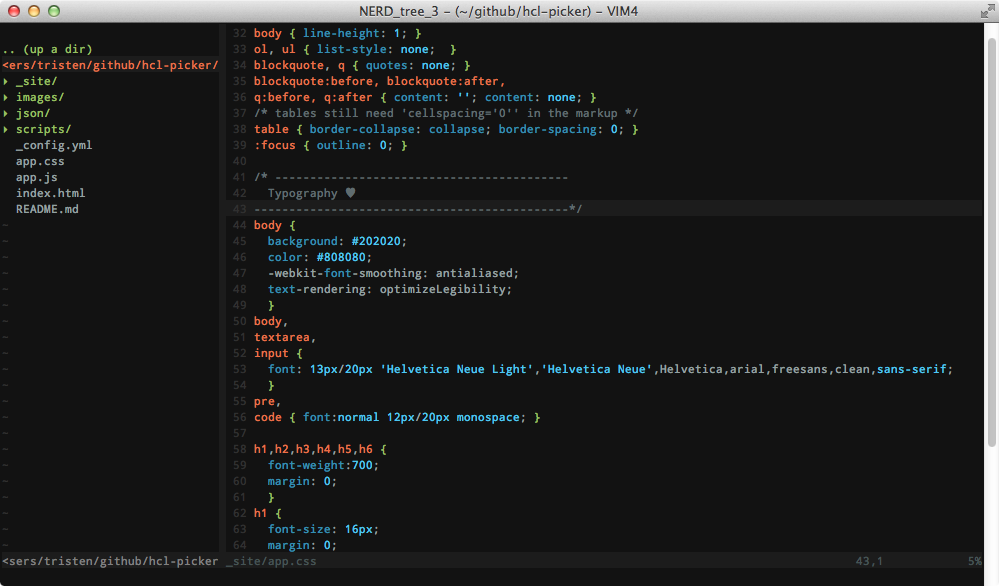
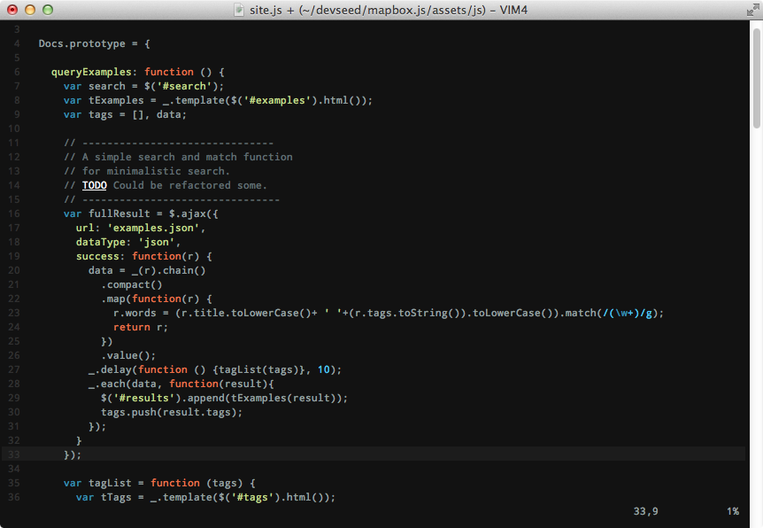

###A gui and console theme for vim.

## Installation

* Copy superman.vim into ~/.vim/colors/ (Unix) or vimfiles/colors/ (Windows)
* Test it by typing `:colorscheme superman`
* If you like it, add `colorscheme superman` in your vimrc file.

## Screenshots

### CSS

### JavaScript

